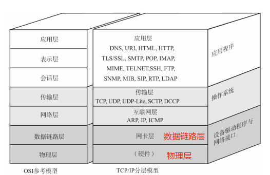
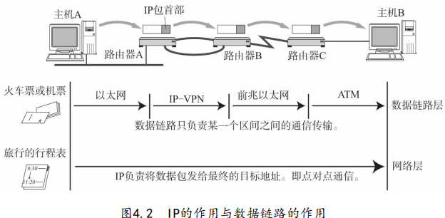
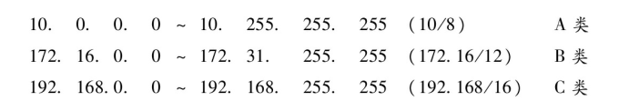
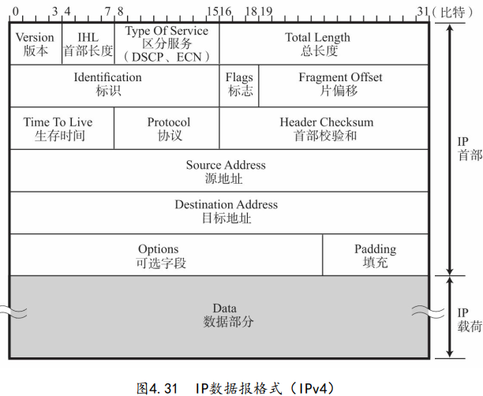

# TCP/IP

上下层之间进行交互时遵循的约定叫**接口**，同层之间交互遵循的约定叫**协议**

**以太网**是一种常用于局域网的网络技术和协议。也就是实现局域网的一种技术

**SMTP**现在仍然是电子邮件**发送**时的协议，接收用POP3或者IMAP

**FTP** File Transfer Protocol 文件传输，由a机硬盘发送到b机硬盘中

**SSh** 、 **TELNET** 远程登录

通信简单流程：（TCP/IP分层）

1. 由应用层产生发送数据
2. 传输层在数据首部添加**源端口，目的端口**  TCP/IP都可以实现
3. 网络层再在首部添加**发送端IP,接收端IP** IP协议添加
4. 链路层再在首部添加**发送端MAC,接收端MAC** 以及 在尾部添加**校验码**

TCP模块处理收到IP传上来的数据后，首先会计算校验和，判断数据是否被破坏，在检查是否按照序号接收数据，最后检查端口号，确定具体的应用程序

**数据链路**可以被称为网络传输中最小单位，**帧**

MAC地址一般会被烧入ROM中，因此任何一个网卡的MAC地址都是唯一的，但也不一定，若我启动多个虚拟机，自己设定MAC地址给多个虚拟网卡，可能就会出现相同的。

**以太网交换机**，非介质共享型网络的设备，即可实现全双工，因为它具有多个端口（此端口非TCP协议里提到的端口）连接多态主机，根据MAC地址发送和接受，交换机内有一个转发表。

**存储转发**，**直通转发**都是指交换机转发方式(数据链路层)

交换机通过端口区分成多个广播数据传播的网段，异构的网段之间需要带有路由功能交换机

以太网是数据链路层的概念，所以数据最前端应该是目的MAC，但其实最最开始还有一个前导码，用来与接收端**确保同步**的

无线LAN==WLAN==无线局域网  **Wireless Local Area Network**

***

## IP协议

TCP/IP的网络层主要的协议就是**IP协议**和**ICMP**

数据链路层在**同一种数据链路**的节点之间进行数据传递，若需要跨越多种数据链路，就需要借助网络层。**网络层可以跨越不同的数据链路**。

> 网络层工作在相对抽象的层次上，不需要关注底层数据链路层的细节，意味着网络层**可以处理来自不同类型数据链路的数据包**，无需担心这些链路的特定特性。

数据链路提供直连两个设备之间的通信，网络层的IP负责在没有直连的两个网络之间进行通信，它俩的关系就如：

> 这里的直连不是传统意义上的有线链接着，是指同种数据链路，数据链路里也有WLAN

不同数据链路的**最大传输单位MTU**不同，因为这个IP要进行**分片处理**。

### **我的疑问**：

1. 网络信息传输最终是在物理层变为电信号传播，那么以数据包为基本信息单位的这个概念是怎样体现的？
2. 数据从应用层一层层包装下来，IP是面向无连接的，TCP是面向链接的，那么有IP必定有TCP的首部，此时IP的面向无连接意义体现在哪？

> 1.每一层都会给原始数据加上首部或者尾部信息，在链路上进行传输时，就是以这些为分割，体现出数据包的概念。
>
> 2.数据是从上往下一层层包装的，所以IP的首部在TCP首部的外面，因此IP的面向无连接确实起到了作用，疯狂在链路中转发，可靠性由TCP保证。

在分配IP地址时，主机标识全为1规定为广播地址，全为0则是代表整个网段。而这只是在**ip地址**上的规定，那么广播数据包最终要在数据连路上进行广播，在**数据链路层**，识别到这段是要广播的，就将**MAC地址**设为FF： FF： FF： FF： FF： FF，因此可以在链路层上实现广播。

**子网划分**实质上就是通过将主机地址的部分再用来作为网络地址，产生比A类、B类等更小粒度的网络。**子网掩码**就是在这里起作用。

**CIDR与子网划分的联系：**

> CIDR任意划分IP地址，更加灵活的划分网络，子网划分将CIDR划分的网络划分成更小的子网。两者结合使用。

私有IP地址范围：在这个范围内的都是私人IP，范围外的属于公网IP.

**私有IP地址结合NAT技术是现在分配IP地址的主流。**

**路由器只做分片不做重组**

> 那若路由器a前后两条数据链路的MTU不相同，路由器不重组继续进行分片会怎样处理？
>
> 要么继续分片要么被丢弃！

以太网MTU默认为1500字节

**IP分片也有不足：**1.路由器的处理负荷加重2.网络安全原因需要对IP数据报进行过滤，因此不希望路由器进行IP数据包分片。因此衍生了**路径MTYU发现**技术(Path MTU Discovery, PMTUD)，**实质上就是以数据链路上最小的MTU在发送端进行分片，这样就避免了在中间路由器上分片**

IPV6是有128bits,每16bits为一组，中间用 **：** 间隔，

**IPV4数据报格式：**

**TTL**在现实中是指可以中转多少个路由，每经过一个就--。

**DNS**(Domain Name System), 就是将域名转换为IP地址的技术。

www.example.com,在这个例子中，com是根域名，example是二级域名，www是主机名。（通常www代表是默认主机，一种约定，其实可以更改）。

**ARP**(Adress Resolution Protocol)以目标IP为线索，获得下一个应该接受数据包的MAC地址。**从IP获得MAC**

**RARP**是将ARP反过来，从MAC获得IP的协议，例如将打印机接入到网络。

**ICMP**辅助IP协议的存在，1.通知出错原因的错误消息2.用于诊断的查询消息。**ICMP是使用IP发送的**，而IP属于尽力而为的协议，因此不能太过于依赖ICMP。

**DHCP**(Dynamic Host Configuration Protocol)，若是给每一台主机设置IP地址很繁琐，为了实现自动设置IP地址、统一管理IP地址分配，DHCP协议。

**NAT**(Network Address Translator),在本地网络中使用私有地址，在连接互联网时使用全局IP的技术。

> 当私有网咯中的多台机器同时向着同一台全局IP的同一端口进行通信时，普通NAT路由都会将私有IP分配一个全局IP发送出去，可万一不够用了此时，那么此时就会将端口号一起转换。
>
> 例如：10.0.0.10:1025与10.0.0.11:1025一起向全局IP 163.221.120.9:80发送数据包，经过NAPT转换，两个私有IP被转换为202.244.174.37:1025与202.244.174.37:1026
>
> 这种技术是**NAPT**(Network Address Ports Translator)，现在人们常说的NAT就是这个技术。

**守护进程**就是长期运行的服务进程，在网络服务中，一般用来监听客户端的请求链接，一般是有一个超级守护进程收到客户端请求后，fork一个进程并通过端口号exec 到类似于http这样的守护进程处理。

 