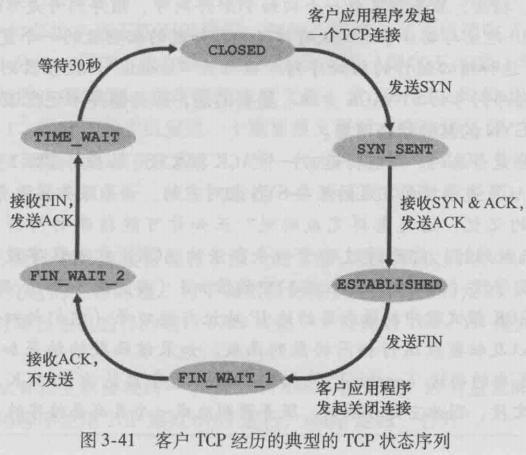
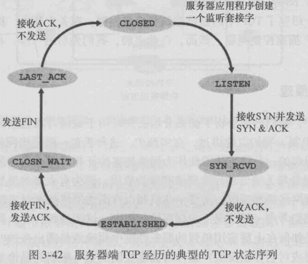

# TCP/IP

上下层之间进行交互时遵循的约定叫**接口**，同层之间交互遵循的约定叫**协议**

**以太网**是一种常用于局域网的网络技术和协议。也就是实现局域网的一种技术

**SMTP**现在仍然是电子邮件**发送**时的协议，接收用POP3或者IMAP

**FTP** File Transfer Protocol 文件传输，由a机硬盘发送到b机硬盘中

**SSh** 、 **TELNET** 远程登录

通信简单流程：（TCP/IP分层）

1. 由应用层产生发送数据
2. 传输层在数据首部添加**源端口，目的端口**  TCP/IP都可以实现
3. 网络层再在首部添加**发送端IP,接收端IP** IP协议添加
4. 链路层再在首部添加**发送端MAC,接收端MAC** 以及 在尾部添加**校验码**

TCP模块处理收到IP传上来的数据后，首先会计算校验和，判断数据是否被破坏，在检查是否按照序号接收数据，最后检查端口号，确定具体的应用程序

**数据链路**可以被称为网络传输中最小单位，**帧**

MAC地址一般会被烧入ROM中，因此任何一个网卡的MAC地址都是唯一的，但也不一定，若我启动多个虚拟机，自己设定MAC地址给多个虚拟网卡，可能就会出现相同的。

**以太网交换机**，非介质共享型网络的设备，即可实现全双工，因为它具有多个端口（此端口非TCP协议里提到的端口）连接多态主机，根据MAC地址发送和接受，交换机内有一个转发表。

**存储转发**，**直通转发**都是指交换机转发方式(数据链路层)

交换机通过端口区分成多个广播数据传播的网段，异构的网段之间需要带有路由功能交换机

以太网是数据链路层的概念，所以数据最前端应该是目的MAC，但其实最最开始还有一个前导码，用来与接收端**确保同步**的

无线LAN==WLAN==无线局域网  **Wireless Local Area Network**

***

## IP协议

TCP/IP的网络层主要的协议就是**IP协议**和**ICMP**

数据链路层在**同一种数据链路**的节点之间进行数据传递，若需要跨越多种数据链路，就需要借助网络层。**网络层可以跨越不同的数据链路**。

> 网络层工作在相对抽象的层次上，不需要关注底层数据链路层的细节，意味着网络层**可以处理来自不同类型数据链路的数据包**，无需担心这些链路的特定特性。

数据链路提供直连两个设备之间的通信，网络层的IP负责在没有直连的两个网络之间进行通信，它俩的关系就如：

> 这里的直连不是传统意义上的有线链接着，是指同种数据链路，数据链路里也有WLAN

不同数据链路的**最大传输单位MTU**不同，因为这个IP要进行**分片处理**。

### **我的疑问**：

1. 网络信息传输最终是在物理层变为电信号传播，那么以数据包为基本信息单位的这个概念是怎样体现的？
2. 数据从应用层一层层包装下来，IP是面向无连接的，TCP是面向链接的，那么有IP必定有TCP的首部，此时IP的面向无连接意义体现在哪？

> 1.每一层都会给原始数据加上首部或者尾部信息，在链路上进行传输时，就是以这些为分割，体现出数据包的概念。
>
> 2.数据是从上往下一层层包装的，所以IP的首部在TCP首部的外面，因此IP的面向无连接确实起到了作用，疯狂在链路中转发，可靠性由TCP保证。

在分配IP地址时，主机标识全为1规定为广播地址，全为0则是代表整个网段。而这只是在**ip地址**上的规定，那么广播数据包最终要在数据连路上进行广播，在**数据链路层**，识别到这段是要广播的，就将**MAC地址**设为FF： FF： FF： FF： FF： FF，因此可以在链路层上实现广播。

**子网划分**实质上就是通过将主机地址的部分再用来作为网络地址，产生比A类、B类等更小粒度的网络。**子网掩码**就是在这里起作用。

**CIDR与子网划分的联系：**

> CIDR任意划分IP地址，更加灵活的划分网络，子网划分将CIDR划分的网络划分成更小的子网。两者结合使用。

私有IP地址范围：在这个范围内的都是私人IP，范围外的属于公网IP.

**私有IP地址结合NAT技术是现在分配IP地址的主流。**

**路由器只做分片不做重组**

> 那若路由器a前后两条数据链路的MTU不相同，路由器不重组继续进行分片会怎样处理？
>
> 要么继续分片要么被丢弃！

以太网MTU默认为1500字节

**IP分片也有不足：**1.路由器的处理负荷加重2.网络安全原因需要对IP数据报进行过滤，因此不希望路由器进行IP数据包分片。因此衍生了**路径MTYU发现**技术(Path MTU Discovery, PMTUD)，**实质上就是以数据链路上最小的MTU在发送端进行分片，这样就避免了在中间路由器上分片**

IPV6是有128bits,每16bits为一组，中间用 **：** 间隔，

**IPV4数据报格式：**

**TTL**在现实中是指可以中转多少个路由，每经过一个就--。

**DNS**(Domain Name System), 就是将域名转换为IP地址的技术。

www.example.com,在这个例子中，com是根域名，example是二级域名，www是主机名。（通常www代表是默认主机，一种约定，其实可以更改）。

**ARP**(Adress Resolution Protocol)以目标IP为线索，获得下一个应该接受数据包的MAC地址。**从IP获得MAC**

**RARP**是将ARP反过来，从MAC获得IP的协议，例如将打印机接入到网络。

**ICMP**辅助IP协议的存在，1.通知出错原因的错误消息2.用于诊断的查询消息。**ICMP是使用IP发送的**，而IP属于尽力而为的协议，因此不能太过于依赖ICMP。

**DHCP**(Dynamic Host Configuration Protocol)，若是给每一台主机设置IP地址很繁琐，为了实现自动设置IP地址、统一管理IP地址分配，DHCP协议。

**NAT**(Network Address Translator),在本地网络中使用私有地址，在连接互联网时使用全局IP的技术。

> 当私有网咯中的多台机器同时向着同一台全局IP的同一端口进行通信时，普通NAT路由都会将私有IP分配一个全局IP发送出去，可万一不够用了此时，那么此时就会将端口号一起转换。
>
> 例如：10.0.0.10:1025与10.0.0.11:1025一起向全局IP 163.221.120.9:80发送数据包，经过NAPT转换，两个私有IP被转换为202.244.174.37:1025与202.244.174.37:1026
>
> 这种技术是**NAPT**(Network Address Ports Translator)，现在人们常说的NAT就是这个技术。

**守护进程**就是长期运行的服务进程，在网络服务中，一般用来监听客户端的请求链接，一般是有一个超级守护进程收到客户端请求后，fork一个进程并通过端口号exec 到类似于http这样的守护进程处理。 

端口号可以用来识别计算机中进行通信的不同应用程序。传输层就是利用这些端口号来识别正在通信的应用程序，准确将数据传输。

TCP/IP与UDP/IP通信都是以 **源目的IP  目标IP 协议号 源端口号 目标端口号**这5项来识别是否为同一通信。

**socket**简单点来说可以将其看做 **特定的协议+端口** 。是一种网络通信的编程接口。

##**TCP**：

* **为什么说TCP又被称为流协议**？因为在TCP连接中，数据不是按照固定大小的数据包传输，而是以字节为单位传输的，就像操作一个字节流一样。以及TCP确保了数据的有序性和可靠性。

* 主机A上的一个进程向主机B上的一个进程发送一个数据流，主机A上的TCP会隐式地对数据流中的**每一个字节编号**，TCP将这一一个报文段的**首字节编号**填入到报文段首部。**确认号**，是主机**期望收到**的下一个字节的序号。

  当主机A收到一个来自主机B 0~235的报文段，又收到了一个500~720的报文段，此时A发送给B的确认号仍然是236，因为TCP只确认该流中第一个丢失的字节，也因此TCP被说**提供累积确认**。收到的500~720会收到缓存中，等待填补。（累积确认是指，**这个序号之前的所有字节我都收到了**）

* 超时重发的时间怎样确定？当建立连接时，TCP会设置一个初始的较短的超时时间。后边进行动态调整，会计算**RTT**(Round-Trip Time)报文段往返时间以及**偏差**，超时时间就设置为这两之和大一些。

  数据被重发后还是收不到确认应答，会再次发送，**等待确认应答的时间**会以2,4倍的指数增长。（是等待确认应答的时间而不是超时重发的时间！）

  当数据重发达到一定次数后，若还没有应答，就判断网络或者对端主机发生异常，强行关闭连接。

* 因为超时重发的间隔（等待丢失报文段的ACK）会导致增大端到端的时延,（在这个间隔期间，发送方会继续发送后面的报文段，而接受方收到后续的报文段之后,发现来的序列号是比自己期望大的，因此立刻发送**冗余ACK**），当收到**3个冗余ACK**时，发送方会立刻重新发送期望的那个报文段

* **流量控制**与**拥塞控制**，都是对**发送方的遏制**。流量控制其实是一种**速度匹配**，即发送方发送速度与接收方应用程序从接受缓存中读取速度。TCP让**发送方维护**一个接收窗口**rwnd变量**（TCP是全双工，因此两端都会有rnwd），用于指示发送方--接收方还有多少的空余空间。接收方会将当前的rnwd放入发送给发送方的字段中，通知发送方自己还有多少空间可用。（UDP没有流量控制，因此应用程序读慢了就会报文段丢失）

**TCP连接管理**：

* 三次握手：client向server发送一个不包含应用层数据的报文段(SYN报文段)，其SYN置为1，发送序号随机选择。server收到后，为链接分配缓存和变量，并回复一个SYN&ACK,ACK是client发送序号+1，再选择一个自己的发送序号。收到SYN&ACK后，此时链接已经建立，SYN置为0，client向server再次发送一个确认，但此次确认可以携带应用层数据了。

  

  **注意client的这个几个FIN_WAIT状态**

* 四次挥手：server和client都可以要求终止链接，多半是client请求终止，client首先发送一个FIN置为1的报文段，server收到后回复一个ACK,表示“自己知道你要终止链接了，等我发完手里的”。server发完手里的数据后，向client发送FIN。此时处于半关闭阶段，server需要等待client对此FIN的ACK,收到后，server关闭。而client还得等待30s，因为可能最后这个ACK丢失了，server还会重复发送FIN。

  

**TCP拥塞控制：**

* TCP连接的每一端都是由一个接收缓存、发送缓存和几个变量（rwnd,LastByteRead,cwnd）组成。cwnd就是拥塞窗口。

* 拥塞定义为：当出现超时或者收到3个冗余ACK时，发送方认为此时链路上出现了拥塞的指示。

* TCP拥塞控制算法主要是三个部分：1.**慢启动** 2.**拥塞避免** 3.**快速恢复**

  **1.慢启动**：是指TCP连接刚开始时，cwnd通常设置为一个**1MSS**（此TCP最大携带数据量），在此阶段cwnd以**指数增长**，每确定一个ACK，拥塞窗口变为2倍。当遇到 **a.**一个超时指示的丢包事件，TCP就将cwnd设为1，从头开始，并将**ssthresh**(慢启动阈值)设置为**cwnd/2**. **b.**遇到ssthresh,慢启动状态结束，转为拥塞避免模式。 **c**.收到3个冗余ACK，进入快速重传模式。

  **2.拥塞避免**：是指cwnd每次只将窗口**增加1MSS**,不再是原先的倍数增长。当遇到 **a.** 超时指示的丢包事件，cwnd设为1，ssthresh设为cwnd/2 **b.** 收到3个冗余ACK,进入快速重传，将**cwnd减半+3个MSS**，ssthresh设为**cwnd/2**  

  **3.快速恢复**：针对于收到3个冗余ACK阶段。对收到的每个冗余ACK,cwnd都会增加一个MSS

  整体的TCP cwnd变化如下：

  

***

## HTTP

* **套接字（socket）是同一台主机内应用层与运输层之间的接口。进程通过一个socket想网络发送报文和接受**。

* HTTP被称为**无状态协议**，是因为服务器端不存储任何关于客户端的信息，同一个客户端在很短时间内发送请求同一个对象，服务器端就只是单纯继续发送给它。

* HTTP请求报文：

  

  第一行是请求行，由**方法字段，URL字段和版本字段构成**。后边的几行是首部行，Host是指请求对象所在的主机，Connection：close是指不开启持续连接，User-agent是向服务器发送请求的浏览器类型。

* HTTP响应报文：

  

  第一行是初始状态行，**版本，状态码，状态信息**。后边的是首部行，以及实体体，实体体就是data. 

* 之前提到HTTP是无状态的，但一些网站想把推送的内容同用户的身份联系起来，这就用到了**cookie**技术。简单来说，cookie将用户进行标识，服务器第一次收到HTTP请求，会为这个用户创建一个ID(就是cookie)，在后端数据库中以此ID建了一条索引。将这个ID添加到响应报文中，客户端读取到之后，在浏览器中存储这条信息(包含ID以及服务器所在主机名)。之后每当用户发起请求，请求报文中都会携带这个cookie信息。

* **Web cache**（Web 缓存，代理服务器）看名字也就明白它是干什么的了，客户端朝着服务器请求太过于慢，于是向着Web cache发起请求，cache中存储着最近请求过的对象，若命中，立刻返回，若没有，cache向服务器发送请求，服务器响应cache，cache保留一个副本，然后发送给客户端。

* GET请求用于从服务器端**获取**数据，**在URL中数据可见**，**不适合传输大数据**(URL中放不下)，GET请求可被浏览器缓存。

  POST请求用于向服务器端**提交**数据，数据**不可见**，**可传输**大量数据，相对于安全。

***

##额外的知识：

1. HTTP与Websocket有什么异同？

   HTTP与Websocket都属于**应用层协议**，只不过**HTTP是被设计成了半双工**（没错，TCP是支持全双工的，HTTP设计之初没考虑到会有两端持续发大量数据的情况），因此是客户端发起请求服务端回应请求，而在应用HTTP时，出现服务器会主动发数据给客户端其实是客户端采用了定时轮询或者长轮询的方式，本质还是客户端发起请求服务端响应。

   而Websocket保持客户端可服务器端的**持续连接**。Websocket实质上通过HTTP**升级**得到的，刚开始Websocket会采用HTTP进行**连接建立**，客户端向服务端发送一个升级请求，服务器端回应，自此Websocket连接建立。

   它和TCP长连接虽然都是使连接持久，但TCP长连接更偏向于底层的持续连接，Websocket是偏向应用程序。

   ​